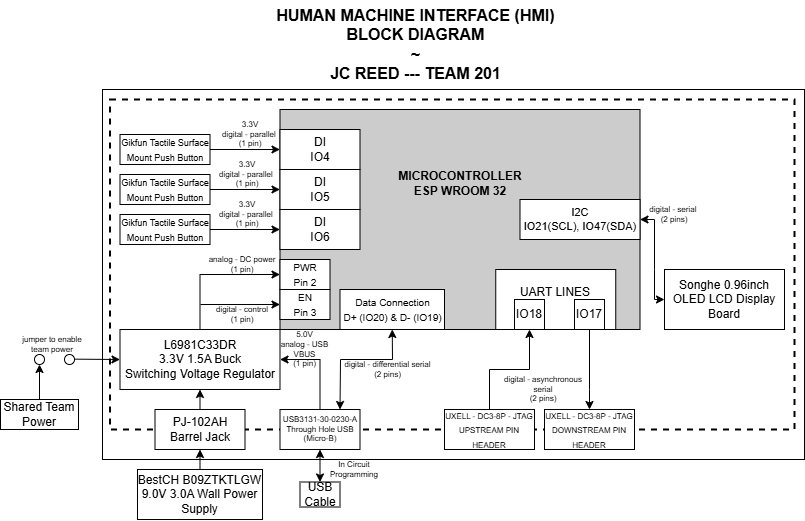

## 

### __Decision Making Process & Meeting Requirments__
For deeper context, the Element Sorter project challenged Team 201 to design an interactive STEM exhibit for middle school students, wherein users engage in a gamified element-sorting activity. My responsibility focused on developing the __Human-Machine Interface (HMI)__ to enable user interaction, provide feedback, and maintain communication across subsystems.

As depicted in my block diagram above, I selected the ESP32 microcontroller for its 3.3V functionality, UART support, and our team's familiarity with its I2C and OLED interfacing from classroom labs — facilitating smooth development of the graphical interface that distinguishes my subsystem through visual interactivity. User input relies on three GPIO pushbuttons connected to digital input pins __(IO4, IO5, IO6)__, chosen for their reliability/familiarity in classroom environments. The block diagram identifies these connections as __"digital @ 3.3V --> parallel (1 pin each)"__ to indicate the direct logic-level interaction.

My subsystem employs UART for serial communication with other components using the predefined protocol structure (prefix, sender, receiver, message type, data, suffix), while I2C connects to the OLED display via two pins, labeled as "digital @ 3.3V --> serial (2 pins)." The power management incorporates a jumper-selectable input system accepting either 9V from a barrel jack or 5V USB, both regulated to 3.3V through a switching regulator — reflected in the block diagram as __"analog @ 9V --> power input (1 line)"__ and __"analog @ 3.3V --> DC power (1 line)."__

Overall, my development approach prioritized educational value and user engagement while meeting the project's technical constraints — [selecting components](https://jcmreed.github.io/Component%20Selection/) and communication protocols based on reliability, compatibility, and previous experience. The resulting block diagram comprehensively illustrates all subsystem interconnections (UART headers), communicates the appropriate voltage levels and protocols, and satisfies our product requirements by enabling the interactive, educational experience regarding the Element Sorter's function — demonstrating how the HMI subsystem supports the broader objective of teaching periodic table concepts through engaging, hands-on interaction.
