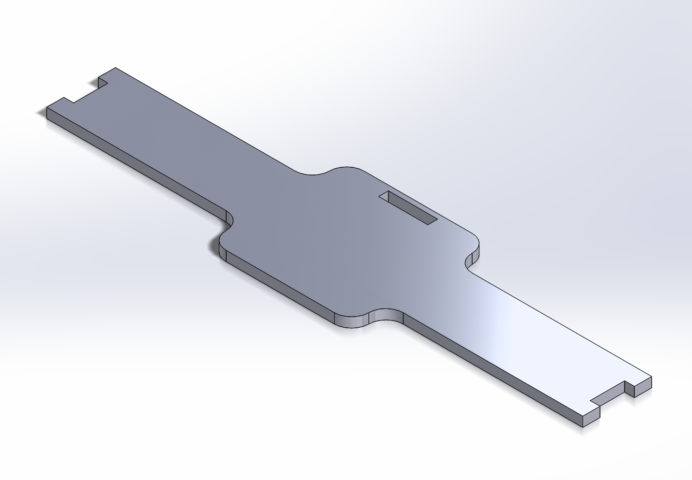

## __Video Showcasing Final HMI Subsystem__
<iframe width="560" height="315" src="https://www.youtube.com/embed/n4pkgeSHHNY?si=4GZxvWbXj-kQadvP" title="YouTube video player" frameborder="0" allow="accelerometer; autoplay; clipboard-write; encrypted-media; gyroscope; picture-in-picture; web-share" referrerpolicy="strict-origin-when-cross-origin" allowfullscreen></iframe>

## __Entire Micropython Code__
```python
# --- Imports ---
import my_oled
import time
import uasyncio as asyncio
from machine import UART, Pin
import random

# --- Debug Mode (Optional Simulation) ---
TEST_MODE = False
TEST_COLOR_NAME = "orange"  # Simulated color if TEST_MODE is True

# --- UART and Message Constants ---
MAX_MESSAGE_LEN = 64
team = [b'H', b'M', b'A', b'S']   # Team device IDs
id = b'H'                         # This HMI device ID
broadcast = b'X'                 # Broadcast ID

# Valid message types and allowed data
VALID_MESSAGE_TYPES = {
    0x00: [0x00],                   # Status Code
    0x01: [0x00, 0x01],             # Drive Mode (0 = Auto, 1 = Manual)
    0x02: [0x00, 0x01, 0x02],       # Sensor Color Data
    0x03: [0x00, 0x01, 0x02]        # Path Selection (User choice)
}

# Color codes sent from sensor
COLOR_CODES = {
    "orange": 0x00,
    "blue": 0x01,
    "green": 0x02,
}

# Elements mapped by color/category
ELEMENTS = {
    0x00: ["Aluminum", "Gold", "Silver", "Iron", "Calcium", "Sodium", "Copper", "Mercury", "Platinum"],     # Metals
    0x01: ["Hydrogen", "Carbon", "Nitrogen", "Oxygen", "Sulfur", "Chlorine", "Helium", "Neon", "Krypton"],  # Non-Metals
    0x02: ["Boron", "Silicon", "Germanium", "Arsenic", "Antimony", "Tellurium"],                            # Metalloids
}

# Element symbols for display
ELEMENT_SYMBOLS = {
    "Aluminum": "Al", "Gold": "Au", "Silver": "Ag", "Iron": "Fe", "Calcium": "Ca", "Sodium": "Na",
    "Copper": "Cu", "Mercury": "Hg", "Platinum": "Pt", "Hydrogen": "H", "Carbon": "C", "Nitrogen": "N",
    "Oxygen": "O", "Sulfur": "S", "Chlorine": "Cl", "Helium": "He", "Neon": "Ne", "Krypton": "Kr",
    "Boron": "B", "Silicon": "Si", "Germanium": "Ge", "Arsenic": "As", "Antimony": "Sb", "Tellurium": "Te"
}

# --- UI State Variables ---
bins = ["Metal", "Non-Metal", "Metalloid"]
yesno = ["YES", "NO"]
selected_element = 0
yesno_selection = 0
detected_color = None
current_element = ""
autonomous_sent = False
led_should_blink = False

# --- Hardware Setup ---
uart = UART(2, 9600, tx=17, rx=18)
uart.init(9600, bits=8, parity=None, stop=1)
led = Pin(7, Pin.OUT)

# --- Button State Tracking ---
previous_up = 1
previous_down = 1
previous_select = 1

# --- State Machine Definitions ---
welcome_state = 0
drive_state = 1
conf_state = 2
feedback_state = 3
state = welcome_state
last_input_time = time.time()

# --- OLED Display Functions ---
def Welcome_Display():
    my_oled.oled.fill(0)
    my_oled.print_text("WELCOME TO THE", 7, 0)
    my_oled.print_text("ELEMENT SORTER!", 6, 10)
    my_oled.print_text("PRESS THE", 26, 35)
    my_oled.print_text("SELECT", 38, 45)
    my_oled.print_text("~      ~", 29, 47)
    my_oled.print_text("BUTTON TO BEGIN!", 2, 55)
    my_oled.oled.show()

def Bin_Display():
    # Display the selected element and bin choices
    my_oled.oled.fill(0)
    my_oled.print_text("WHAT TYPE OF", 15, 0)
    my_oled.print_text("ELEMENT IS:", 20, 10)
    my_oled.print_text(current_element, 28, 22)
    symbol = ELEMENT_SYMBOLS.get(current_element, "??")
    my_oled.oled.rect(2, 34, 30, 30, 1)
    my_oled.print_text(symbol, 10, 45)
    for i, bin_name in enumerate(bins):
        y_pos = 36 + (i * 10)
        if i == selected_element:
            my_oled.oled.fill_rect(41, y_pos - 2, 78, 10, 1)
            my_oled.print_text(bin_name, 43, y_pos, 0)
        else:
            my_oled.print_text(bin_name, 43, y_pos, 1)
    my_oled.oled.show()

def Conf_Display():
    # Display confirmation screen before sending user's answer
    my_oled.oled.fill(0)
    my_oled.print_text("YOU'VE SELECTED:", 0, 0)
    my_oled.print_text(bins[selected_element], 17, 10)
    my_oled.print_text("CONFIRM?", 0, 30)
    for i, conf in enumerate(yesno):
        y_pos = 40 + (i * 10)
        if i == yesno_selection:
            my_oled.oled.fill_rect(10, y_pos - 2, 30, 10, 1)
            my_oled.print_text(conf, 12, y_pos, 0)
        else:
            my_oled.print_text(conf, 12, y_pos, 1)
    my_oled.oled.show()

def Feedback_Display(correct, correct_category=None):
    # Show if the answer was correct/incorrect
    my_oled.oled.fill(0)
    if correct:
        my_oled.print_text("YOU ARE", 35, 10)
        my_oled.print_text("CORRECT!", 33, 20)
    else:
        my_oled.print_text("YOU ARE", 35, 0)
        my_oled.print_text("INCORRECT!", 28, 9)
        if correct_category:
            my_oled.print_text("Answer:", 0, 26)
            my_oled.print_text(correct_category, 55, 26)
    my_oled.print_text("DETECTING NEW", 10, 46)
    my_oled.print_text("ELEMENT...", 25, 56)
    my_oled.oled.show()

# --- UART Messaging ---
def send_message(sender, receiver, msg_type, data):
    # Validate and send formatted UART message
    if sender not in team or (receiver not in team and receiver != broadcast): return
    if msg_type not in VALID_MESSAGE_TYPES or data not in VALID_MESSAGE_TYPES[msg_type]: return
    msg = b"AZ" + sender + receiver + bytes([msg_type]) + bytes([data]) + b"YB"
    uart.write(msg)

def handle_color_detection(color_code):
    global detected_color, current_element
    detected_color = color_code
    current_element = random.choice(ELEMENTS[detected_color])

def reset_to_welcome():
    # Reset UI state to welcome screen
    global state, selected_element, yesno_selection, previous_up, previous_down, previous_select
    selected_element = 0
    yesno_selection = 0
    previous_up = 1
    previous_down = 1
    previous_select = 1
    state = welcome_state
    Welcome_Display()

def handle_message(msg):
    global state, last_input_time, autonomous_sent, led_should_blink
    if len(msg) < 7 or len(msg) > MAX_MESSAGE_LEN: return
    if not (msg.startswith(b"AZ") and msg.endswith(b"YB")): return
    sender, receiver = msg[2:3], msg[3:4]
    msg_type, data = msg[4], msg[5]
    if sender == id: return  # Ignore self

    if receiver == id or receiver == broadcast:
        if msg_type == 0x00 and data == 0x00:
            led_should_blink = True
        elif msg_type == 0x02:
            handle_color_detection(data)
        elif msg_type == 0x01 and data == 0x00:
            reset_to_welcome()
            autonomous_sent = True
            send_message(id, broadcast, 0x01, 0x00)

    # Always forward valid messages not from self
    if sender != id:
        uart.write(msg)

# --- Async UART Message Receiver ---
async def process_rx():
    buf = b''
    receiving = False
    while True:
        c = uart.read(1)
        if c:
            buf += c
            if buf[-2:] == b'AZ': buf, receiving = b'AZ', True
            if receiving and buf[-2:] == b'YB':
                receiving = False
                handle_message(buf)
                buf = b''
            if len(buf) > MAX_MESSAGE_LEN:
                buf = b''
                receiving = False
        await asyncio.sleep_ms(10)

# --- Async LED Blink (status indicator) ---
async def blink_led():
    while True:
        if led_should_blink:
            led.value(not led.value())
        await asyncio.sleep_ms(500)

# --- Main HMI Event Loop ---
async def hmi_loop():
    global previous_up, previous_down, previous_select
    global selected_element, yesno_selection, state, last_input_time, autonomous_sent

    Welcome_Display()

    # Inject test message if enabled
    if TEST_MODE and TEST_COLOR_NAME in COLOR_CODES:
        await asyncio.sleep(1)
        test_msg = b"AZ" + b'S' + id + bytes([0x02]) + bytes([COLOR_CODES[TEST_COLOR_NAME]]) + b"YB"
        handle_message(test_msg)

    while True:
        current_up = my_oled.buttonUP.value()
        current_down = my_oled.buttonDOWN.value()
        current_select = my_oled.buttonSELECT.value()
        now = time.time()

        # Auto-reset if no activity for 2 minutes
        if now - last_input_time > 120 and not autonomous_sent:
            reset_to_welcome()
            if detected_color is not None:
                send_message(id, broadcast, 0x01, 0x00)
                autonomous_sent = True

        # --- State Logic ---
        if state == welcome_state:
            if current_select == 0 and previous_select == 1:
                last_input_time = now
                state = drive_state
                Bin_Display()
                send_message(id, broadcast, 0x01, 0x01)
                autonomous_sent = False

        elif state == drive_state:
            if current_up == 0 and previous_up == 1:
                selected_element = (selected_element - 1) % len(bins)
                Bin_Display()
                last_input_time = now
            if current_down == 0 and previous_down == 1:
                selected_element = (selected_element + 1) % len(bins)
                Bin_Display()
                last_input_time = now
            if current_select == 0 and previous_select == 1:
                state = conf_state
                Conf_Display()
                last_input_time = now

        elif state == conf_state:
            if current_up == 0 and previous_up == 1:
                yesno_selection = (yesno_selection - 1) % 2
                Conf_Display()
                last_input_time = now
            if current_down == 0 and previous_down == 1:
                yesno_selection = (yesno_selection + 1) % 2
                Conf_Display()
                last_input_time = now
            if current_select == 0 and previous_select == 1:
                if yesno_selection == 0:
                    send_message(id, b'X', 0x03, selected_element)
                    correct = selected_element == detected_color
                    correct_category = bins[detected_color]
                    Feedback_Display(correct, correct_category)
                    await asyncio.sleep(6)
                    state = drive_state
                    Bin_Display()
                else:
                    state = drive_state
                    Bin_Display()
                last_input_time = now

        # Save current button states
        previous_up = current_up
        previous_down = current_down
        previous_select = current_select
        await asyncio.sleep(0.01)

# --- Main Program Startup ---
async def main():
    led.value(1)  # LED solid on at start
    send_message(id, b'S', 0x00, 0x00)  # Status update
    asyncio.create_task(process_rx())
    asyncio.create_task(blink_led())
    asyncio.create_task(hmi_loop())
    while True:
        await asyncio.sleep(1)

# --- Run Program ---
try:
    asyncio.run(main())
finally:
    asyncio.new_event_loop()  # Ensure loop cleanup

```
### [ZIP File (Full ESP32 Code Project)](https://www.dropbox.com/scl/fi/55x5pb8690gg1eezanmdn/Final-HMI-Code.zip?rlkey=kodr0qi83y22pp747hb1wczsh&st=5u200o3y&dl=0)

## __CAD Modeling Used (OLED Stand + PCB Baseplate)__

| <br> <center>__PCB Mount__</center> |  <br> <center>__Full HMI Display__</center>|
|----------|--------|
| <br> <center>__Mounting Arm__</center> |  <br> <center>__OLED Mount__</center>|

### [ZIP File (CAD Files + Screenshots)](https://www.dropbox.com/scl/fi/ktyll28mq2uq1pk49krji/HMI-CAD-Files.zip?rlkey=4vba82vfc8x5x9vgf0fx8nohp&st=3zeinaun&dl=0)