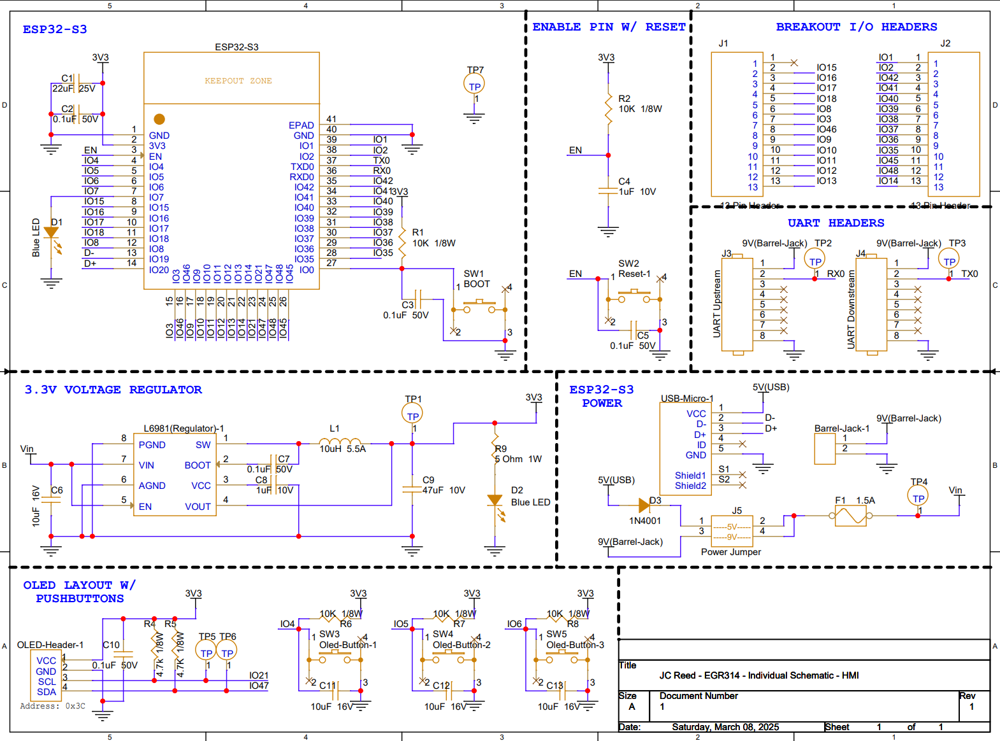
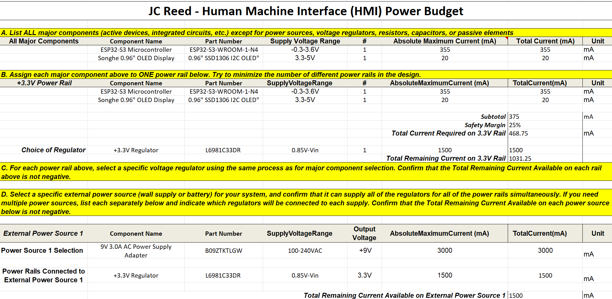

__This page is dedicated to discuss my schematic and printed circuit board (PCB) designed specifically for the Human Machine Interface.__

Included in the schematic are seven different sections, each with their own responsibility to allow the HMI board to function. The PCB is a physical representation of the schematic and includes all hardware providing the necessary functionality. The functionality of these designs satisfies user needs and product requirements by including a working layout of powering a programmable LED display screen. This screen provides 'exhibit-goers' with the option to interactively select the direction the marbles should take through the inclusion of pushbuttons. The designs also allow for UART implementation, which is how the subsystem communicates to other subsystems within the team. 

### __Schematic Design__
## 

### __Printed Circuit Board (PCB) Design__
## 

### __Links for High Resolution Visibility__
- [PDF (Schematic)](https://www.dropbox.com/scl/fi/f9w1i6sscxlyywqqm48h3/IndividualSchematic-HMI-PDF.pdf?rlkey=8xb6ayctkginnebk0vwqdsbgr&st=gkm1hwtc&dl=0)
- [PDF (PCB)]()
- [ZIP Folder (Schematic)](https://www.dropbox.com/scl/fi/p3rfl7ne41s3101rtt6n1/Reed-Individual-Schematic-HMI.zip?rlkey=dbggk973my06dv4h1e9o1611x&st=gdkw6vrx&dl=0)
- [ZIP Folder (PCB)]()

### __Power Budget__

The power budget is extremely useful in providing viable component options that  safely operate the entire board. This process acts as confirmation and reassurance, while eliminating overall risks of damaging devices. 