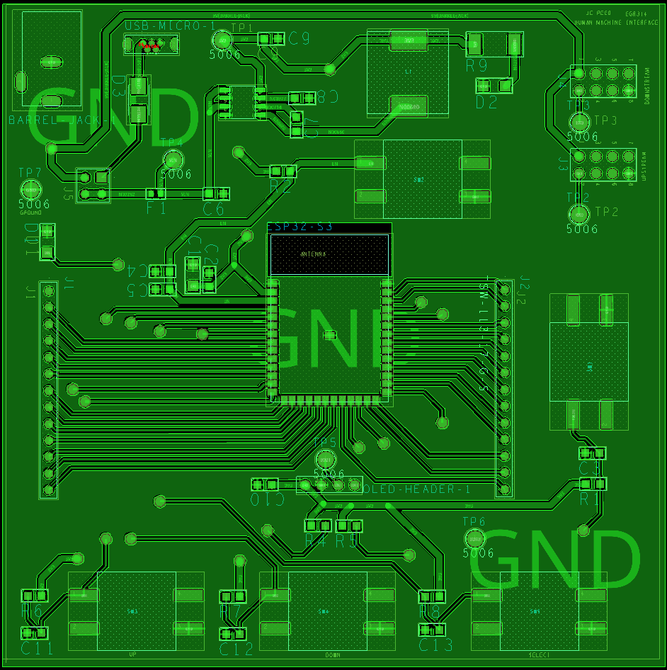

## __Schematic Design__
## 

## __Printed Circuit Board (PCB) Design__
__Front View__

__Back View__
.png)

### __Links for High Resolution Visibility__
- [PDF (Schematic)](https://www.dropbox.com/scl/fi/f9w1i6sscxlyywqqm48h3/IndividualSchematic-HMI-PDF.pdf?rlkey=8xb6ayctkginnebk0vwqdsbgr&st=gkm1hwtc&dl=0)
- [PDF (PCB)](https://www.dropbox.com/scl/fi/6415172i94j4g0n9ks7wz/egr314-pcb.pdf?rlkey=y5skzk8u1ucwclvq4b6xmhiw7&st=i34cb0tu&dl=0)
- [ZIP Folder (Schematic)](https://www.dropbox.com/scl/fi/7beqg12lv1ck94jwv221e/Reed-Individual-Schematic-HMI.zip?rlkey=qo0x32zzfb3nxm8twjv387nnf&st=shj8wj0g&dl=0)
- [ZIP Folder (PCB)](https://www.dropbox.com/scl/fi/0rkh08bn1l5gziiwjobsp/Reed-GerberFilesv4.zip?rlkey=7kpe3iyqmpdn1z5ggpjw43w8u&st=a3mcz4uk&dl=0)

### __Decision Making Process & Meeting Requirements__
The HMI subsystem schematic/PCB integrates power regulation, user input mechanisms, visual feedback elements, and inter-subsystem communication capabilities into a cohesive, reliable design — fulfilling both the technical product requirements and user interaction goals for our middle school-targeted STEM exhibit.

The ESP32-S3-WROOM-1-N4 microcontroller forms the core of the design, connected to three GPIO-driven pushbuttons, an I2C OLED display, and UART lines that enable communication with other subsystems. Each pushbutton incorporates hardware debouncing via 10kΩ pull-up resistors complemented by software filtering to ensure clean signal transitions and responsive user interaction. The I2C data lines (SDA/SCL) feature 4.7kΩ pull-up resistors that maintain reliable OLED display communication in accordance with I2C specifications.

To satisfy the 3.3V system voltage requirement, the schematic employs the L6981C33DR buck switching regulator with jumper-selectable power input from either a 9V 3.0A barrel jack or 5V USB source. Input/output capacitors positioned at the regulator's VIN and VOUT pins maintain voltage stability, while local decoupling capacitors near the ESP32 and display minimize noise and ensure stable operation.

Programming and debugging capabilities include USB D+ and D− lines routed to the appropriate ESP32-S3 USB-capable pins (IO19, 20) for native USB programming, a standard BOOT circuit utilizing IO0, and the EN pin with pull-up to facilitate manual flashing when necessary. Two UART headers enable communication with other subsystems, fulfilling our serial protocol requirement, while a current-limited blue status LED provides users with a clear power-on indication — an essential visual cue for exhibit functionality.

The layout features widened power traces to accommodate expected current flow safely. Although only the top layer includes a ground plane for improved signal integrity and thermal performance, the absence of a bottom-side ground plane represents a minor oversight for future revision. Nevertheless, the component placement and routing support reliable operation and serviceability.

The schematic successfully incorporates all required functionalities into a logical, robust system — enabling intuitive user interaction, meeting power and communication specifications, and implementing standard hardware design practices such as decoupling, pull-ups, and regulated voltage supply to ensure long-term functionality in the educational environment.

### __Version 2.0 of PCB Design__
While my schematic design was functionally sound—resulting in a fully working HMI subsystem—there are several hardware layout issues I would address in a Version 2.0 revision. Most notably, I initially routed the UART lines to RX0 and TX0, which conflicted with the ESP32’s USB REPL interface. I had to bypass this using jumper wires to reassign UART to alternate GPIOs, which worked but was a workaround rather than a clean solution.

Additionally, I accidentally mirrored the pinout of my 2x4 UART header, reversing the order of pins 1–8. This made the pre-designed ribbon cables incompatible with the PCB and forced me to fabricate a custom cable to match our team's required format—where pin 1 was 3.3V power, pin 2 was communication, and pin 8 was ground.

Another layout issue was the placement of the OLED header, which ended up too close to the user pushbuttons. To resolve this, I 3D-printed a small riser and used fly wires to elevate and reposition the screen.

Finally, while I included a ground plane on the top layer, I neglected to fill the bottom layer, which would have improved noise immunity and thermal performance. These changes would significantly improve reliability and usability in a future revision.

## __Team PCB Design__

As pictured above, Team 201 comprised four members, each assigned to a specific subsystem (left-to-right): __Human-Machine Interface (HMI), Sensor, MQTT, and Actuator__ — arranged in a daisy-chain communication configuration that reflected the logical progression of user interaction. This sequence began with the HMI initiating the process, followed by the sensor detecting a ball, MQTT functioning as the communication bridge, and concluding with the actuator repositioning the ball according to user selection.

Our design decisions responded directly to both project goals and class requirements — particularly the mandated UART-based message structure and 2x4 ribbon cable pinout standard that ensured cross-subsystem compatibility while providing a unified technical foundation for development.

Microcontroller selection balanced practicality and performance considerations — implementing the ESP32 for both HMI and MQTT subsystems due to our familiarity with it from previous laboratory exercises and its compatibility with I2C, UART, and USB programming protocols. Conversely, PIC microcontrollers served the sensor and actuator subsystems, selected for their precise timing capabilities and robust hardware interfacing options.

Integration and debugging processes occurred collaboratively to validate communication pathways and system workflow. My HMI hardware decisions — including UART pin mapping and header configuration — required careful coordination with teammates to ensure seamless connectivity and interaction throughout the Element Sorter device.
