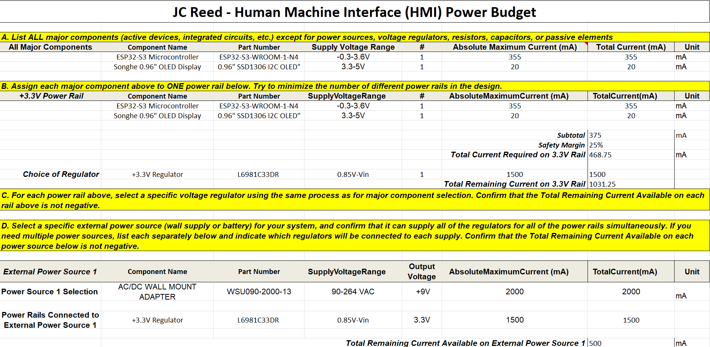

__Pictured below is my schematic designed specifically for the Human Machine Interface. Included in the schematic are seven different sections, each with their own responsibility to allow the HMI board to function.__

This functionality of this schematic satisfies user needs and product requirements by including a working layout of powering a programmable LED display screen. This screen provides 'exhibit-goers' with the option to visibly select the direction the marbles should take. The schematic also allows for UART implementation, which is how the actuator receives HMI inputs. 

## 

### __Links for High Resolution Visibility__
- [PDF](https://www.dropbox.com/scl/fi/f9w1i6sscxlyywqqm48h3/IndividualSchematic-HMI-PDF.pdf?rlkey=8xb6ayctkginnebk0vwqdsbgr&st=gkm1hwtc&dl=0)
- [ZIP Folder](https://www.dropbox.com/scl/fi/p3rfl7ne41s3101rtt6n1/Reed-Individual-Schematic-HMI.zip?rlkey=dbggk973my06dv4h1e9o1611x&st=gdkw6vrx&dl=0)

### __Power Budget__

The power budget is extremely useful in providing viable component options that  safely operate the entire board. This process acts as confirmation and reassurance, while eliminating overall risks of damaging devices. 